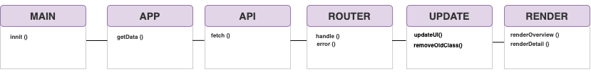

# Web App From Scratch @cmda-minor-web 1819


## Inhoudspagina

- [Live Demo](#Live-Demo)
- [To Do](#To-Do)
- [Beschrijving](#Beschrijving)
- [Leerdoelen](#Leerdoelen)
- [Gebruik](#Gebruiks)
- [API](#API)
- [Actor Diagram](#Actor-Diagram)
- [Interactive Diagram](#Interactive-Diagram)
- [Punten voor in de toekomst](#Punten-voor-in-de-toekomst)
- [Bronnen](#Bronnen)

## Live Demo

[Live Demo](https://zeijls.github.io/web-app-from-scratch-1920/)

## To Do

Week 1

- [ ] 2. Readme afmaken (Marjolein en robin stut doorlezen)
- [x] 3. Loading data asynchronously from an API (Monday / Tuesday)
- [x] MAP
- [x] FILTER
- [x] REDUCE
- [x] Issues verwerken

Week 2

- [ ] Actor diagram.
- [ ] Interactive diagram
- [x] Refactor code
- [x] Key aanpassen in url (kijken issue van Marten)

Week 3

- [x] Functies opdelen in modules
- [ ] Error state?? (Feedback loading) States toevoegen
- [x] 3. Reflect on work (Tuesday)

- [ ] Nadelen client side renderen van HTML kunnen benoemen (Zoeken in aantekeningen)
- [ ] Criteria nog goed doorlezen
- [ ] Beoordeling voorbereiden
- [ ] Best practices doorlezen

## Beschrijving

Op de webapplicatie zijn alle schilderijen van Rembrandt van Rijn in het rijksmuseum weergegeven. De titel wordt in een hover weergegeven. Zodra je op een schilderij klikt worden de kleuren die in het schilderij zitten weergegeven. Daarnaast kun je zien waar het schilderij is gemaakt en de schilder.

## Leerdoelen

- You can add structure to your code by applying patterns.
- You can defend the choice for the chosen patterns
- You can retrieve data, manipulate it and dynamically convert it to html elements using templating
- You understand how you can work with an external API using asynchronous code
- You understand how you can manage state in your application and you inform the user of state where necessary

## Gebruik

Ga via de terminal naar de folder waar je het project in wilt plaatsen.

Go via the terminal to the folder you want the project to be placed:

```
cd Pth/To/Folder
```

Clone de repositroy

```
    git clone https://github.com/MarjoleinAardewijn/web-app-from-scratch-1920.git
    cd web-app-from-scratch-1920
```

Na het clonen, open het `index.html` bestnd in je localhost.

## API

In deze applicatie gebruik ik de API van het Rijksmuseum. In deze API is een groot deel van de collectie van het Rijksmuseum verzameld. Alle details van de schilerderijen worden hierin weergegeven. Vanwege copyright restricties zijn kunstwerken van de 20e en 21e eeuw niet toegevoegd in deze API.

Om gebruik te maken van de API van het Rijksmuseum heb nodig. Deze kun je aanvragen bij de gevanceerde account instellingen op de site van het Rijksumseum. https://www.rijksmuseum.nl/en/rijksstudio/

Ik heb alleen de schilderijen van Rembrandt van Gogh gebruikt door de volgende endpoints te gebruiken.

> const rijksAPI = baseURl + key + involvedMaker + maker;

Er bleven 9 schilderijen over. Vanaf dit punt heb ik deze schilderijen verder uitgezocht door middel van Map, Filter en Reduce.

## Actor Diagram



## Interactive Diagram


## Punten voor in de toekomst

- [] Schilderijen van Rembrandt van Rijn ook in een filter opzoeken
- []

## Bronnen

<!-- Add a link to your live demo in Github Pages 🌐-->

<!-- ☝️ replace this description with a description of your own work -->

<!-- replace the code in the /docs folder with your own, so you can showcase your work with GitHub Pages 🌍 -->

<!-- Add a nice poster image here at the end of the week, showing off your shiny frontend 📸 -->

<!-- Maybe a table of contents here? 📚 -->

<!-- How about a section that describes how to install this project? 🤓 -->

<!-- ...but how does one use this project? What are its features 🤔 -->

<!-- What external data source is featured in your project and what are its properties 🌠 -->

<!-- Maybe a checklist of done stuff and stuff still on your wishlist? ✅ -->

<!-- How about a license here? 📜 (or is it a licence?) 🤷 -->
