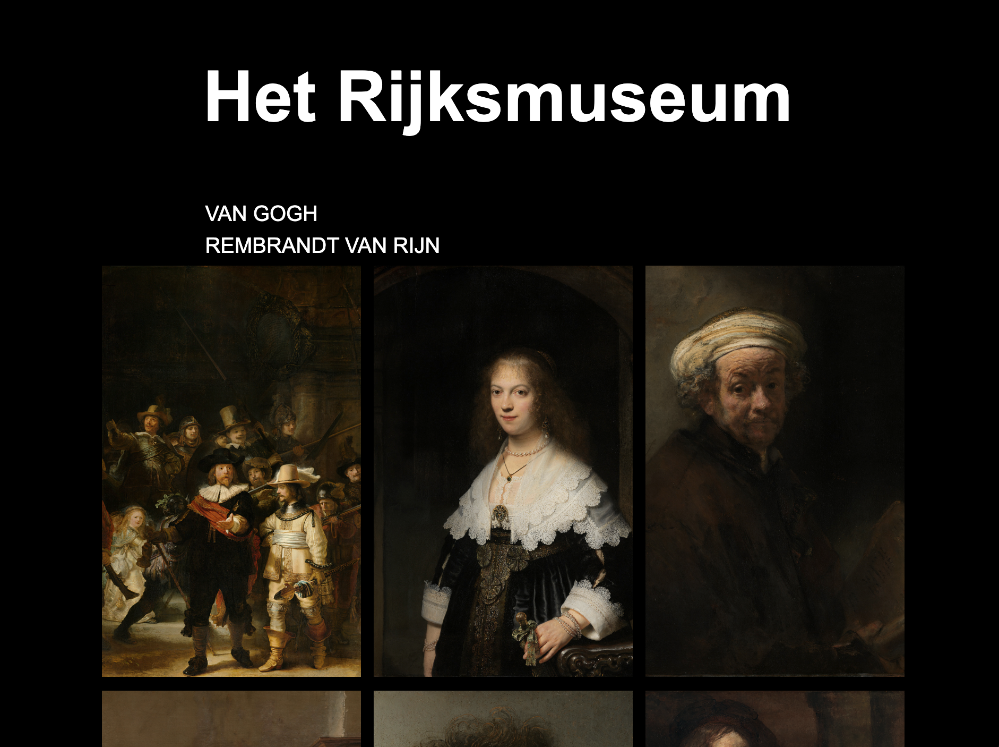

# Web App From Scratch @cmda-minor-web 1819

[Live Demo](https://zeijls.github.io/web-app-from-scratch-1920/);

## Inhoudspagina

- Actor Diagram
- Interactive Diagram
- Leerdoelen
- Beschrijving
- API
- Bronnen

## Leerdoelen

- You can add structure to your code by applying patterns.
- You can defend the choice for the chosen patterns
- You can retrieve data, manipulate it and dynamically convert it to html elements using templating
- You understand how you can work with an external API using asynchronous code
- You understand how you can manage state in your application and you inform the user of state where necessary

## Beschrijving

Op de webapplicatie zijn de verschillende schilderijen van het rijksmuseum weergegeven. De titel wordt in een hover weergegeven. Zodra je op een schilderij klikt worden de kleuren die in het schilderij zitten weergegeven. Daarnaast kun je zien waar het schilderij is gemaakt en de schilder.

## API

In deze applicatie gebruik ik de API van het Rijksmuseum. In deze API is een groot deel van de collectie van het Rijksmuseum verzameld. Alle details van de schilerderijen worden hierin weergegeven. Vanwege copyright restricties zijn kunstwerken van de 20e en 21e eeuw niet toegevoegd in deze API.

Om gebruik te maken van de API van het Rijksmuseum heeft men een key nodig. Deze kan men aanvragen bij de gevanceerde account instellingen op de site van het Rijksumseum. https://www.rijksmuseum.nl/en/rijksstudio/

## How to install

## Features

## External data source

## Check list done stuff

## Wishlist

## License

## Actor Diagram

## Interactive Diagram

## Bronnen

<!-- Add a link to your live demo in Github Pages 🌐-->

<!-- ☝️ replace this description with a description of your own work -->

<!-- replace the code in the /docs folder with your own, so you can showcase your work with GitHub Pages 🌍 -->

<!-- Add a nice poster image here at the end of the week, showing off your shiny frontend 📸 -->

<!-- Maybe a table of contents here? 📚 -->

<!-- How about a section that describes how to install this project? 🤓 -->

<!-- ...but how does one use this project? What are its features 🤔 -->

<!-- What external data source is featured in your project and what are its properties 🌠 -->

<!-- Maybe a checklist of done stuff and stuff still on your wishlist? ✅ -->

<!-- How about a license here? 📜 (or is it a licence?) 🤷 -->
