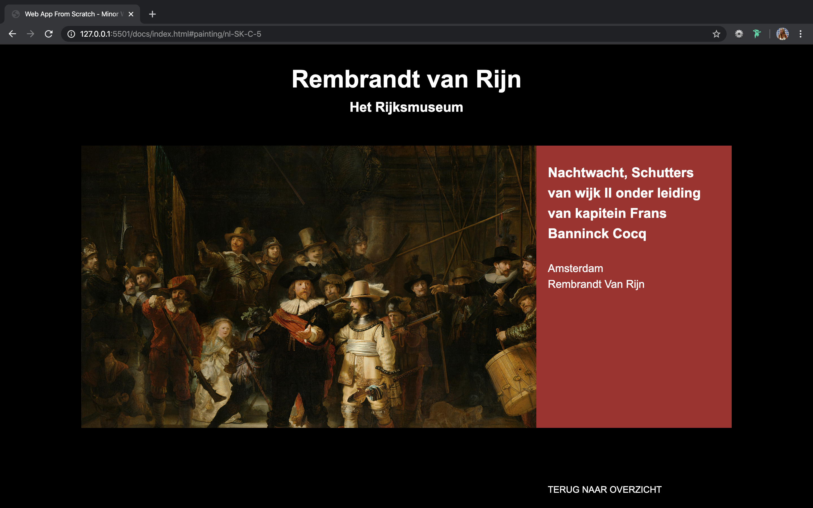
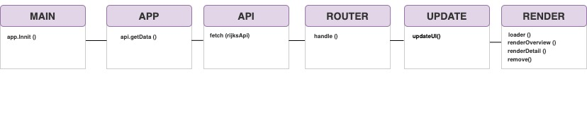
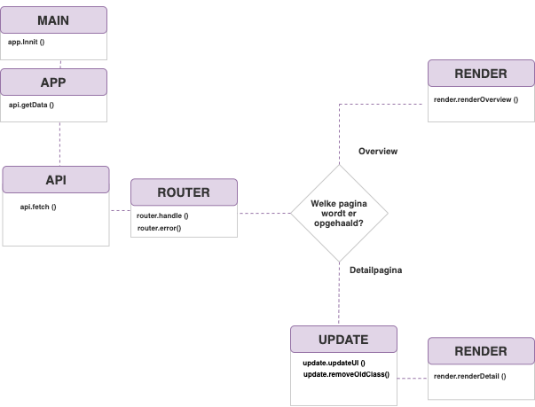

# Rembrandt van Rijn in het Rijksmuseum

## Web App From Scratch @cmda-minor-web 1819




## Inhoudspagina

- [Live Demo](#Live-Demo)
- [To Do](#To-Do)
- [Beschrijving](#Beschrijving)
- [Leerdoelen](#Leerdoelen)
- [Gebruik](#Gebruiks)
- [API](#API)
- [Actor Diagram](#Actor-Diagram)
- [Interactive Diagram](#Interactive-Diagram)
- [Punten voor in de toekomst](#Punten-voor-in-de-toekomst)
- [Bronnen](#Bronnen)

## Live Demo

[Live Demo](https://zeijls.github.io/web-app-from-scratch-1920/)

## Opdracht

- Data moet vanuit een API worden gerenderd in de HTML
- De data uit de API wordt asynchroon opgehaald
- Voor het oog is er een overzichts en detailpagina met gebruik van een router (single page web app)
- De code is opgedeeld in modules
- De code visueel maken dmv een Actor Diagram en Interactive Diagram
- De applicatie bevat states
- De code is dynamisch

## Concept

Op de webapplicatie zijn alle schilderijen van Rembrandt van Rijn in het Rijksmuseum weergegeven. Zodra een schilderij wordt geselecteerd worden de details weergegeven. Als het ophalen van de schilderijen lang duurt is er een loadingstate.

## De structuur

# Actor Diagram



# Interactive Diagram



## Gebruik

Ga via de terminal naar de folder waar je het project in wilt plaatsen.

Go via the terminal to the folder you want the project to be placed:

```
cd Pth/To/Folder
```

Clone de repositroy

```
    git clone https://github.com/MarjoleinAardewijn/web-app-from-scratch-1920.git
    cd web-app-from-scratch-1920
```

Na het clonen, open het `index.html` bestnd in je localhost.

## API

In deze applicatie gebruik ik de API van het Rijksmuseum. In deze API is een groot deel van de collectie van het Rijksmuseum verzameld. Alle details van de schilerderijen worden hierin weergegeven. Vanwege copyright restricties zijn kunstwerken van de 20e en 21e eeuw niet toegevoegd in deze API.

Om gebruik te maken van de API van het Rijksmuseum heb nodig. Deze kun je aanvragen bij de gevanceerde account instellingen op de site van het Rijksumseum. https://www.rijksmuseum.nl/en/rijksstudio/

Ik heb alleen de schilderijen van Rembrandt van Gogh gebruikt door de volgende endpoints te gebruiken.

> const rijksAPI = baseURl + key + involvedMaker + maker;

Er bleven 9 schilderijen over. Vanaf dit punt heb ik deze schilderijen verder uitgezocht door middel van Map, Filter en Reduce.

## To Do

Week 1

- [ ] 2. Readme afmaken (Marjolein en robin stut doorlezen)
- [x] 3. Loading data asynchronously from an API (Monday / Tuesday)
- [x] MAP
- [x] FILTER
- [x] REDUCE
- [x] Issues verwerken

Week 2

- [x] Actor diagram.
- [ ] Interactive diagram
- [x] Refactor code
- [x] Key aanpassen in url (kijken issue van Marten)

Week 3

- [x] Functies opdelen in modules
- [x] States toevoegen (Feedback loading)
- [x] 3. Reflect on work (Tuesday)

- [ ] Nadelen client side renderen van HTML kunnen benoemen (Zoeken in aantekeningen)
- [ ] Criteria nog goed doorlezen
- [ ] Beoordeling voorbereiden
- [x] Best practices doorlezen

## Punten voor in de toekomst

- [] Schilderijen van Rembrandt van Rijn ook in een filter zetten
- []

## Bronnen

- [Promise Then](https://developer.mozilla.org/en-US/docs/Web/JavaScript/Reference/Global_Objects/Promise/then)
- [Fetch](https://developer.mozilla.org/en-US/docs/Web/API/Fetch_API/Using_Fetch)
- [Routen](http://projects.jga.me/routie/)
- [Update UI from route](https://github.com/cmda-minor-web/web-app-from-scratch-1920/tree/master/examples)
- [Insert Adjacent HTML](https://developer.mozilla.org/en-US/docs/Web/API/Element/insertAdjacentHTML)
- [Inner HTML](https://developer.mozilla.org/en-US/docs/Web/API/Element/innerHTML)
- [Map](https://developer.mozilla.org/en-US/docs/Web/JavaScript/Reference/Global_Objects/Map)
- [Filter](https://developer.mozilla.org/nl/docs/Web/JavaScript/Reference/Global_Objects/Array/filter)
- [Reduce](https://developer.mozilla.org/en-US/docs/Web/JavaScript/Reference/Global_Objects/Array/Reduce)
- [While](https://developer.mozilla.org/en-US/docs/Web/JavaScript/Reference/Statements/while)

## Credits

- Robin Stut, hij hielp me met...
